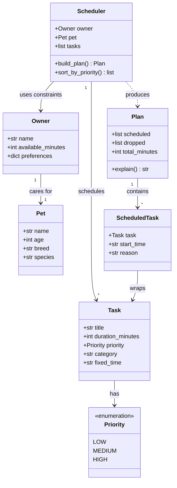

# Claude Code session log — c0637e56

## 🧑 You  _2026-06-24 01:07:47_

how do i open a forked folder in vscode

## 🤖 Claude  _2026-06-24 01:07:49_

Failed to authenticate. API Error: 401 Invalid authentication credentials

## 🧑 You  _2026-06-24 01:08:05_

what?

## 🤖 Claude  _2026-06-24 01:08:12_

It sounds like you've forked a repo on GitHub and want to open your local copy in VSCode. Here's the flow:

**1. Clone your fork to your computer** (forking on GitHub only makes a copy on GitHub — you need it locally):

```bash
git clone https://github.com/<your-username>/<repo-name>.git
```

**2. Open the folder in VSCode**, any of these work:

- **From the terminal:** `code <repo-name>` (or `cd` into it, then `code .`)
- **From VSCode:** `File → Open Folder…` and pick the cloned folder
- **Drag** the folder onto the VSCode window

---

If you meant something different by "forked folder," tell me what you're starting from:
- A repo you forked on GitHub?
- A git worktree / branch?
- A folder you copied locally?

And where it currently is (a URL, or already on your machine), and I'll give you the exact steps.

## 🧑 You  _2026-06-24 01:08:40_

i mean, how do i do it using the terminal

## 🤖 Claude  _2026-06-24 01:08:45_

Use the `code` command:

```bash
# Open a folder by path
code /path/to/your-folder

# Or cd into it first, then open the current folder with "."
cd /path/to/your-folder
code .
```

If you just cloned your fork, it'd be:

```bash
git clone https://github.com/<your-username>/<repo>.git
cd <repo>
code .
```

---

**If `code` isn't found**, the CLI command isn't on your PATH yet. Fix it from inside VSCode:

1. Open VSCode
2. Press `Cmd+Shift+P` to open the Command Palette
3. Type and run: **Shell Command: Install 'code' command in PATH**
4. Open a new terminal window, and `code .` will work

## 🧑 You  _2026-06-24 01:10:43_

addishiwotdagnew@Addishiwots-MacBook-Air A110codepath % https://github.com/addishiwotbel2025/ai110-module2show-pawpal-starter.git
zsh: no such file or directory: https://github.com/addishiwotbel2025/ai110-module2show-pawpal-starter.git
addishiwotdagnew@Addishiwots-MacBook-Air A110codepath %

## 🤖 Claude  _2026-06-24 01:10:46_

You pasted just the URL — that's not a command, so zsh tried to run the URL as a program. You need `git clone` in front of it.

```bash
git clone https://github.com/addishiwotbel2025/ai110-module2show-pawpal-starter.git
cd ai110-module2show-pawpal-starter
code .
```

- **Line 1** downloads the repo into a new folder
- **Line 2** moves into that folder
- **Line 3** opens it in VSCode

## 🤖 Claude  _2026-06-24 01:14:46_

You're in the wrong folder. You're in `A110codepath`, but `requirements.txt` lives inside the cloned `ai110-module2show-pawpal-starter` folder.

`cd` into it first, then install:

```bash
cd ai110-module2show-pawpal-starter
pip install -r requirements.txt
```

Your `.venv` is still active, so that's fine. (You could also open that folder directly with `code .` once you're inside it.)

## 🤖 Claude  _2026-06-24 01:43:17_

Let me look at the starter project so my suggestions fit what you're actually building.

_(used tools: Bash)_

_(used tools: Bash)_

_(used tools: Bash)_

## 🤖 Claude  _2026-06-24 01:44:05_

Good news — you've got the right instincts (Pet, Owner, and a planner class). But there's one structural issue worth fixing now, before you write code, because it'll shape everything else.

## The big one: model tasks as objects, not as methods

Your `pet care class` lists `walking dog`, `feeding dog`, `giving medication`… as separate methods. That hardcodes the activities into the class. The problem:

- Every new activity = editing the class and adding a method.
- The scheduler can't loop over tasks generically (it'd need a special case per method).
- It doesn't match the UI — look at [app.py:54-66](ai110-module2show-pawpal-starter/app.py#L54-L66): each task is just `{title, duration_minutes, priority}`. Generic data.

Instead, make **`Task`** a thing with attributes. Walking, feeding, meds become *instances* of `Task`, not methods:

```
Task
    title           ("Morning walk")
    duration_minutes
    priority        (low / medium / high)
    fixed_time      (optional — meds at 8am, grooming at a set time)
    category        (walk / feed / med / groom / enrichment)
```

This is the key OOP move: **data that varies → attributes, not methods.**

## Suggested class breakdown

| Class | Holds | Does |
|-------|-------|------|
| `Pet` | name, age, breed, **species** | — |
| `Owner` | name, available_minutes, preferences | — |
| `Task` | title, duration, priority, fixed_time | maybe `__repr__` |
| `Scheduler` | owner + pet + list of `Task` | `build_plan()` → ordered plan |
| `Plan` (or list of `ScheduledTask`) | task + start_time + reason | display |

A couple of notes:
- **Add `species` to `Pet`** — the UI already asks for dog/cat/other ([app.py:46](ai110-module2show-pawpal-starter/app.py#L46)). Your outline assumes dog-only.
- Your "class that calculates everything" is the **`Scheduler`** — good instinct. But the requirement isn't just "return how many hours we need." It's: *choose which tasks fit, order them, and explain why* ([README.md](ai110-module2show-pawpal-starter/README.md), "Generate a daily schedule… and explain the reasoning").

## The part your outline is missing: what happens when time runs out

This is the actual interesting logic, and where the "explain why" requirement lives. If the owner has 60 min but tasks total 90 min, the scheduler has to **decide what to drop**. That decision *is* the explanation:

> "Dropped grooming (low priority) — only 60 min available, prioritized walk + meds."

So `Scheduler.build_plan()` roughly:
1. Sort tasks by priority (high → low).
2. Add tasks while time remains; skip ones that don't fit.
3. Return the plan **plus a reason per task** (kept or dropped).

That gives you something concrete to write tests against ("given 60 min and these 3 tasks, the low-priority one gets dropped") — which the README also asks for.

---

Want me to turn this into a `uml.mmd` mermaid diagram you can drop into [diagrams/uml.mmd](ai110-module2show-pawpal-starter/diagrams/uml.mmd), or would you rather sketch it yourself first and have me review it?

## 🤖 Claude  _2026-06-24 01:55:02_

I'll write the UML into your diagram file as a mermaid class diagram.

_(used tools: Write)_

_(used tools: Read)_

_(used tools: Write)_

## 🤖 Claude  _2026-06-24 04:53:08_

Done — written to [diagrams/uml.mmd](ai110-module2show-pawpal-starter/diagrams/uml.mmd). Here's the design:



**How to read it:**
- **Pet / Owner** — plain data holders.
- **Task** — generic; a walk, feeding, or meds are all just `Task` instances (the shift we talked about).
- **Priority** — an enum so you sort/compare cleanly instead of juggling `"high"`/`"low"` strings.
- **Scheduler** — takes the owner's `available_minutes` + the task list, runs `build_plan()`, returns a **Plan**.
- **Plan** — the output: what got `scheduled` (each a `ScheduledTask` with a time + a `reason`), what got `dropped`, and `explain()` for the "why."

**To preview it:** VSCode renders `.mmd` with a Mermaid extension, or paste it into [mermaid.live](https://mermaid.live).

---

## What's next

Per the README's workflow, the next step is **class stubs — no logic yet**. Turn each box above into an empty Python class so the structure compiles, then fill in `build_plan()` incrementally and write tests against it.

Want me to generate the stub files (e.g. `models.py` + `scheduler.py`) from this diagram, or do you want to write them yourself and have me review?

## 🤖 Claude  _2026-07-01 01:19:38_

You've made changes (the UML, reflection.md) and want to save them to your fork on GitHub. Two ways — VSCode UI or terminal.

## Option A: VSCode Source Control panel (clickable)

1. Click the **Source Control** icon in the left sidebar (branch icon, or `Cmd+Shift+G`).
2. You'll see your changed files. Hover a file and click **+** to stage it (or **+** on "Changes" to stage all).
3. Type a **commit message** in the box at the top (e.g. "Add PawPal UML diagram").
4. Click **Commit**.
5. Click **Sync Changes** (or the **···** menu → **Push**) to send it up to your fork on GitHub.

## Option B: Terminal

From inside the repo folder:

```bash
cd "/Users/addishiwotdagnew/Documents/Personal projects/codepath/A110codepath/ai110-module2show-pawpal-starter"
git add .
git commit -m "Add PawPal UML diagram and reflection"
git push
```

- `git add .` — stage all changes
- `git commit -m "..."` — save them as a commit locally
- `git push` — upload to your fork on GitHub

---

⚠️ One thing to watch: that pawpal folder is its **own** cloned repo, separate from the outer `A110codepath` repo. Whichever folder you're in when you run the commands is the one you're committing to. Run `git remote -v` if you want to confirm you're pushing to *your* fork (`addishiwotbel2025/...`) and not the original.
